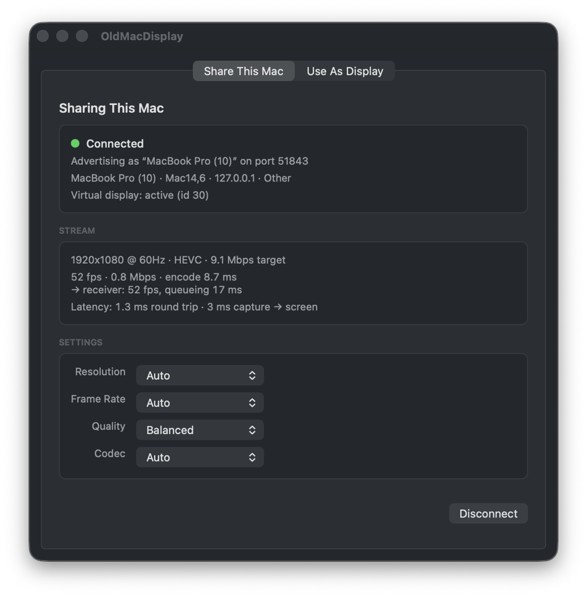
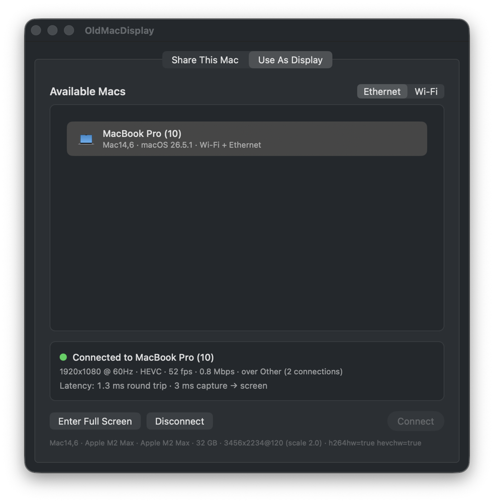
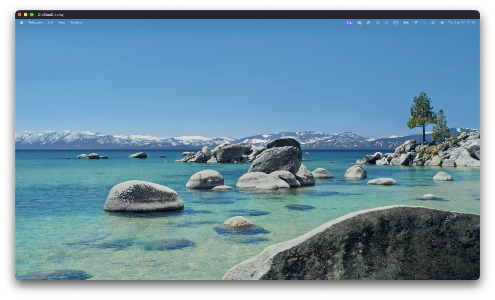

# OldMacDisplay

Use a 2013 Intel iMac as a real extended display for an Apple Silicon Mac.

Not mirroring: the Host creates a virtual monitor that macOS extends onto, so
windows can be dragged to the right and appear on the old Mac.

**Status:** working end to end on real hardware — virtual display, capture,
H.264/HEVC encode, stream over two TCP connections, hardware decode,
full-screen render, out-of-band cursor, adaptive bitrate, measured
capture-to-screen latency. Protocol version 2.

| Share This Mac (Host) | Use As Display (Receiver) |
|---|---|
|  |  |



*Both screenshots were taken with the app connected to itself over loopback,
which is why the latency figures are so low. Real numbers over a LAN are in
"What to expect" below.*

## Contents

- [How it works](#how-it-works)
- [Requirements](#requirements)
- [Install](#install)
- [First run: permissions](#first-run-permissions)
- [Using it](#using-it)
- [Settings](#settings)
- [Reading the status panels](#reading-the-status-panels)
- [Command-line flags](#command-line-flags)
- [What to expect](#what-to-expect)
- [Troubleshooting](#troubleshooting)
- [Building from source](#building-from-source)
- [Layout](#layout)
- [Latency design](#latency-design)
- [Protocol](#protocol)
- [Diagnostics](#diagnostics)
- [Limitations](#limitations)

## How it works

```
 Apple Silicon Mac (Host)                      2013 iMac (Receiver)
 ┌──────────────────────────────┐              ┌──────────────────────────┐
 │ CGVirtualDisplay (private)   │              │                          │
 │   ↓ ScreenCaptureKit         │  control TCP │  NWConnection            │
 │   ↓ VideoToolbox H.264/HEVC  │ ───────────▶ │   ↓ CMSampleBuffer       │
 │   ↓ HostSession              │  video TCP   │   ↓ AVSampleBufferDisplay│
 │      cursor, stats, ping     │ ───────────▶ │     Layer (HW decode)    │
 └──────────────────────────────┘              └──────────────────────────┘
```

1. The Host creates a virtual display at the negotiated resolution. macOS
   places it to the right of the main screen, exactly like a plugged-in
   monitor.
2. ScreenCaptureKit captures only that display, without the cursor.
3. VideoToolbox encodes it in hardware, tuned for latency: real-time mode, no
   B-frames, long GOP with keyframes on demand.
4. Frames go over a dedicated TCP connection; control traffic (handshake,
   heartbeat, cursor position, statistics) goes over another so it is never
   stuck behind a large frame.
5. The Receiver hands the bitstream straight to `AVSampleBufferDisplayLayer`,
   which decodes in hardware and displays immediately. The cursor is drawn as
   an overlay from the positions the Host sends.
6. Once a second the Receiver reports what actually reached its screen. The
   Host uses that to adapt the bitrate.

## Requirements

| | Host ("Share This Mac") | Receiver ("Use As Display") |
|---|---|---|
| macOS | 13 Ventura or later | 10.15 Catalina or later |
| Hardware | Apple Silicon or Intel with hardware H.264 encode | Any Mac with hardware H.264 decode (2011 or later) |
| Tested on | MacBook Pro M2 Max, macOS 26 | iMac 2013 (Haswell, Iris Pro), Catalina |
| Network | Gigabit Ethernet recommended, Wi-Fi works | same |

One universal `.app` contains both roles. Copy the same bundle to both
machines; each one enables the half it can run.

## Install

There is no App Store build (the virtual display needs private API, see
[docs/VIRTUAL_DISPLAY.md](docs/VIRTUAL_DISPLAY.md)).

**Download:** grab `OldMacDisplay.zip` from the
[latest release](https://github.com/kilcimurat/OldMacDisplay/releases/latest).
It is one universal app for both Macs. Unzip it, drag the app anywhere, and
skip to [First run: permissions](#first-run-permissions).

**Or build it yourself** once on the modern Mac, then copy it to the old one:

```sh
git clone https://github.com/kilcimurat/OldMacDisplay.git
cd OldMacDisplay
./Scripts/build.sh
```

This runs the unit tests, builds the universal app, signs it, verifies the
binary launches on Catalina, and produces:

```
build/OldMacDisplay.app
build/OldMacDisplay.zip     ← copy THIS to the old Mac
```

**Copy the zip, not the .app.** A plain Finder copy to a USB stick or a
network share can lose the executable bit, after which macOS refuses to treat
the bundle as an application. The zip is made with `ditto` and preserves it.
On the old Mac, double-click the zip and drag the app anywhere.

On Catalina, the first launch may be blocked by Gatekeeper because the app is
not notarised. Right-click the app, choose **Open**, then confirm.

## First run: permissions

### Host (modern Mac)

**Screen Recording** is required or there is nothing to stream. macOS asks on
the first connection attempt. If you declined, the Host tab shows the error
with an **Open Screen Recording Settings…** button. After granting it,
**restart the app**: macOS only applies this permission at launch.

The build script signs with your Apple Development certificate when one is
present, so the permission survives rebuilds. With an ad-hoc signature every
rebuild revokes it (the script warns about this).

### Both machines, macOS 15 or later

**Local Network** permission. macOS asks on first launch. If it is denied,
Bonjour discovery returns zero results with no error at all. Fix it in
System Settings › Privacy & Security › Local Network.

### Firewall

If the macOS firewall is on, allow incoming connections for OldMacDisplay on
the Host when asked. The Host listens on TCP port 51843.

## Using it

1. **On the modern Mac**, launch OldMacDisplay. It opens on **Share This Mac**
   and immediately starts advertising on the LAN. The status card reads
   "Waiting for a receiver".
2. **On the old Mac**, launch OldMacDisplay. It opens on **Use As Display**
   and lists every Host it can see. Pick the link you want to use with the
   **Ethernet / Wi-Fi** switch; only Hosts reachable over that link are shown.
3. Select the Host and click **Connect**. The two machines negotiate a
   resolution, codec and bitrate from the Receiver's panel size, decoder
   hardware and link type.
4. The Host creates the virtual display; the stream opens in its own window
   on the old Mac, sized to show the image 1:1 when it fits.
5. Click **Enter Full Screen** (or ⌃⌘F) to make the old Mac behave like a
   monitor. Esc leaves full screen.
6. On the modern Mac, drag windows to the right; they appear on the old Mac.
   System Settings › Displays shows the virtual display and lets you arrange
   it like any other.

To end the session, click **Disconnect** on either side, or close the stream
window on the old Mac. The virtual display disappears from the Host and the
windows on it move back to the main screen.

### Unplugging and reconnecting

If the cable is pulled or Wi-Fi drops, the Receiver keeps the last frame on
screen and retries for **30 seconds** with a short backoff. If the Host comes
back within that window, the session resumes with a fresh keyframe and no
user action. After 30 seconds it gives up and reports why.

## Settings

All settings live on the Host tab and take effect on the next connection
(changing them mid-session renegotiates and restarts the stream).

| Setting | Options | What it does |
|---|---|---|
| **Resolution** | Auto, 1920×1080, 2560×1440, Native | *Auto* picks the largest of 1920×1080, 2560×1440, 1680×1050, 1440×900, 1280×800 that fits the Receiver's panel — capped at 1080p on Wi-Fi. *Native* uses the panel's exact size. |
| **Frame Rate** | Auto, 30, 60 | *Auto* uses what the Receiver's panel reports (60 Hz on a 2013 iMac). 30 halves the bitrate for the same quality. |
| **Quality** | Performance, Balanced, Quality | Sets the bitrate budget: about 12, 20 and 30 Mbps for 1080p60 on Ethernet. On Wi-Fi each is reduced by 30 % and capped at 20 Mbps. |
| **Codec** | Auto, H.264, HEVC | *Auto* uses HEVC only when **both** ends decode and encode it in hardware. A 2013 iMac cannot, so it resolves to H.264 there. Forcing HEVC on a Receiver without hardware decode still falls back to H.264. |

**For a 2013 iMac over Ethernet** the defaults (Auto / Auto / Balanced / Auto)
give 1920×1080 @ 60 Hz, H.264, ~20 Mbps. For the 27" model, choose
2560×1440 or Native to use the whole panel; expect ~35 Mbps.

## Reading the status panels

### Host tab

```
1920x1080 @ 60Hz · H264 · 19.9 Mbps target
57 fps · 12.4 Mbps · encode 4.1 ms · adapted to 14.0 Mbps
→ receiver: 57 fps, queueing 12 ms
Latency: 3.2 ms round trip · 31 ms capture → screen
```

- **target** is what negotiation asked for. **adapted to** appears only when
  the adaptive controller has moved the encoder off that target because the
  link could not carry it. If it keeps appearing, the link is the bottleneck.
- **fps / Mbps / encode** are the Host's own numbers. The fps drops to near
  zero on a still desktop: ScreenCaptureKit only produces changed frames,
  so this is normal, not a stall.
- **→ receiver** is the other Mac's view and is the one that matters. A gap
  between the two fps figures means frames are being lost on the way.
  **dropped** appears if the Receiver's renderer had to discard frames;
  **queueing** is how much later than schedule the worst frame of the last
  second arrived. Under 30 ms is jitter; sustained 100 ms+ is congestion.
- **capture → screen** is the true one-way latency from the frame being
  captured on the Host to being handed to the display on the Receiver, using
  a clock alignment derived from the heartbeat. Add roughly one frame for
  the decode and the panel's own refresh.

### Receiver tab

```
1920x1080 @ 60Hz · H264 · 57 fps · 12.4 Mbps · over Ethernet (2 connections)
Latency: 3.2 ms round trip · 31 ms capture → screen
```

**(2 connections)** confirms video is on its own connection. If it is
missing, the second connection could not be established and video is sharing
the control connection; the stream still works but a large keyframe can delay
control messages.

The grey line at the bottom is the Receiver's detected hardware: model, CPU,
GPU, memory, panel size and refresh rate, and whether H.264/HEVC decode is in
hardware. This is what it sends to the Host to negotiate with.

## Command-line flags

Useful for diagnostics, direct-cable setups and scripting:

| Flag | Side | Effect |
|---|---|---|
| `--connect HOST[:PORT]` | Receiver | Skip Bonjour and connect to an address. Needed on a direct Ethernet cable where mDNS may not work. |
| `--auto-connect "NAME"` | Receiver | Connect to the first discovered Host whose name contains NAME. |
| `--tab host` / `--tab receiver` | both | Which tab to open on. Default: Host if this Mac can host, else Receiver. |
| `--resolution 1920x1080` | Host | Same as the Resolution setting. |
| `--fps 60` | Host | Same as the Frame Rate setting. |
| `--codec h264` / `hevc` / `auto` | Host | Same as the Codec setting. |
| `--quit-after SECONDS` | both | Exit automatically, for unattended tests. |

Example — old Mac connected by a direct cable to a Host at 192.168.2.2,
opening straight onto the Receiver tab:

```sh
/Applications/OldMacDisplay.app/Contents/MacOS/OldMacDisplay --tab receiver --connect 192.168.2.2
```

Example — test the whole pipeline on one Mac (the second instance connects to
the first over loopback):

```sh
build/OldMacDisplay.app/Contents/MacOS/OldMacDisplay --tab host &
build/OldMacDisplay.app/Contents/MacOS/OldMacDisplay --tab receiver --connect 127.0.0.1
```

## What to expect

Only two data points come from the real 2013 iMac so far, both from before
the latency work; everything else here is what the design targets, not a
measurement. Once you have run a session, the **capture → screen** figure in
either panel is the number to trust.

| Link | Mode | Observed / expected |
|---|---|---|
| Wi-Fi, same room, 1080p | negotiated by Auto | Observed: usable, with stutter whenever the link hiccups (RTT median 7 ms with spikes to 640 ms were recorded). The adaptive controller now lowers bitrate on such spikes and recovers within seconds. |
| Wi-Fi, 2560×1440 @ 60 | forced | Observed: lagged badly. This is why Auto caps Wi-Fi at 1080p. |
| Gigabit Ethernet, 1080p60 | Auto | Expected: smooth, capture-to-screen a few tens of milliseconds. Not yet measured on the iMac. |

Latency is dominated by the network and the Receiver's decode. It is meant for
documentation, terminals, chat and code; it is not meant for gaming or video
editing.

**Picture quality.** Text is sharp at the default Balanced budget. After
scrolling stops, the Host re-encodes the still frame twice (a refinement
frame after 120 ms and a full keyframe after 600 ms), so any blockiness from
the motion burst clears within about half a second. If text still looks soft,
raise Quality; if the link cannot sustain it, the Host panel will show
"adapted to" and you should lower it again.

## Troubleshooting

**The Host does not appear in the list.**
- Both machines must be on the same subnet. Check the Ethernet / Wi-Fi switch
  on the Receiver: a Host that is only reachable over the other link is
  hidden.
- macOS 15+: Local Network permission on *both* machines. A denial is silent.
- A full-tunnel VPN on either side hides Bonjour. Disconnect it.
- Direct cable with no router: mDNS may not work. Use `--connect` with the
  Host's IP (System Settings › Network on the Host shows it).

**The Host is listed in red / "incompatible".**
The two machines run different protocol versions. Copy the same build to
both. The subtitle names the version each side speaks.

**Connect stays on "Connecting…" then fails after 6 seconds.**
The address resolved but nothing answered: firewall on the Host blocking
port 51843, or a VPN routing the traffic away. The Receiver retries for 30 s.

**"Host is already connected to another display".**
The Host accepts one Receiver at a time. Disconnect the other one first.

**Black stream window, Host shows "Screen Recording permission is required".**
Grant it in System Settings › Privacy & Security › Screen Recording and
**restart OldMacDisplay on the Host**.

**The virtual display appears but the picture is blocky.**
Check the Host panel. If "adapted to" is much below the target, the link is
saturated: move to Ethernet, or drop Frame Rate to 30, or Quality to
Performance. If there is no "adapted to", raise Quality.

**Stutter every few seconds on Wi-Fi.**
Wi-Fi shares airtime; a neighbour's download or your own iCloud sync causes
it. The Receiver's "dropped" and "queueing" figures show it happening. Ethernet
is the real fix.

**The display stays after the session ends.**
The virtual display is removed when the session ends or the Host quits. If
macOS ever keeps it (it can if the display's mode was changed in System
Settings while it existed), quitting the Host removes it.

**Nothing works and there are no error messages.**
Read the log, see [Diagnostics](#diagnostics).

## Building from source

Requirements: Xcode 26 (or its Command Line Tools) on an Apple Silicon or
Intel Mac. No third-party dependencies.

```sh
./Scripts/build.sh          # tests, universal app, Catalina verification, zip
./Scripts/build.sh app      # just the app
./Scripts/build.sh test     # just the Shared unit tests
```

Or, for iteration on one architecture:

```sh
cd App && swift build       # debug, host architecture only
cd Shared && swift test     # 104 unit tests, all pure logic
```

Signing: the script uses the first `Apple Development` identity in your
keychain, or `CODESIGN_IDENTITY` if set, or an ad-hoc signature as a last
resort. A stable identity matters because TCC remembers permissions per
designated requirement; ad-hoc requirements change on every build.

### The three constraints that shape the code

The Receiver has to run on Catalina on an Intel iMac, and the same binary
hosts on an M2 Max. That forces:

1. **No Swift Concurrency anywhere.** `async`/`await` back-deploys to 10.15
   only by embedding `libswift_Concurrency.dylib`. The whole app uses
   callbacks and GCD instead, so the binary needs no back-deployment runtime.
2. **ScreenCaptureKit is weak-linked.** It does not exist on Catalina; a
   strong link would stop the app launching there.
3. **AppKit, not SwiftUI.** The SwiftUI `App` lifecycle is macOS 11+.

`Scripts/verify-catalina.sh` checks all three against the built x86_64 slice
on every build, plus that every strongly-linked dylib existed in 10.15. It
runs automatically and fails the build. Details in
[docs/RECEIVER_COMPATIBILITY.md](docs/RECEIVER_COMPATIBILITY.md).

## Layout

```
OldMacDisplay/
├── App/        the application (universal, macOS 10.15+)
│   └── Sources/
│       ├── OldMacDisplay/
│       │   ├── Shell/      app entry, tabbed window, both panes
│       │   ├── Host/       virtual display, capture, cursor, encode, serve
│       │   └── Receiver/   discover, connect, decode, render
│       └── OMDPrivateDisplay/   the only private-API code (Objective-C)
├── Shared/     protocol, messages, models, transport, controllers (+ 104 tests)
├── Scripts/    build.sh, verify-catalina.sh, icon generator
└── docs/       VIRTUAL_DISPLAY.md, RECEIVER_COMPATIBILITY.md, images/
```

## Latency design

Everything on the frame path is built around one rule: never let a backlog
form, because on this link lag accumulates rather than recovering.

* **Two TCP connections per session.** Control (handshake, heartbeat, keyframe
  requests, cursor) and video are separate, so a ping or an IDR request is
  never stuck behind a 300 KB keyframe. The Receiver opens the second
  connection to the address the first one resolved to and binds it with the
  session token the Host issued in its `hello`. If the second connection is
  refused or drops, video falls back to the control connection.
* **Exact-length socket reads, no copies.** The transport reads a 12-byte
  header, then exactly the payload, and hands that buffer to CoreMedia. The
  encoder's output is sent as header + bitstream in one scatter-gather batch;
  the bitstream `Data` points into VideoToolbox's block buffer.
* **No main-thread hop for frames.** Decoded sample buffers go from the network
  queue straight to `AVSampleBufferDisplayLayer`, which is thread-safe for it.
* **The cursor is not in the video.** ScreenCaptureKit captures without the
  pointer; the Host samples its position at the frame rate and sends it on the
  control connection, with the cursor image only when its shape changes. A
  still desktop with a moving mouse costs nothing on the wire.
* **Long GOP, keyframes on demand.** TCP loses nothing, so periodic IDRs only
  cost bitrate. The keyframe interval is 30 s and every path that can
  desynchronise the decoder (a drop on either side, a late join, a reconnect,
  a carrier switch) explicitly asks for one, with parameter sets attached.
* **Still-screen refresh.** ScreenCaptureKit emits nothing while the screen is
  unchanged, which would leave the Receiver looking at the last, cheaply
  encoded frame of a scroll forever. 120 ms after motion stops the Host
  re-encodes the frame; 600 ms after, it sends a full keyframe. Keyframe
  refreshes are limited to one per 2 s so a blinking caret cannot flood the
  link.
* **Adaptive bitrate from the Receiver's view.** Once a second the Receiver
  reports displayed fps, its renderer's drop ratio and the worst queueing
  excess it measured (how much later than schedule frames arrived, which needs
  no clock sync). `BitrateController` backs the encoder off by 30 % after two
  consecutive bad seconds, or immediately on Host-side drops, and recovers
  15 % at a time after three clean seconds and a 5 s hold.
* **Capture-to-screen latency is measured, not guessed.** Each pong carries the
  responder's clock; `ClockOffsetEstimator` takes the minimum-RTT sample to
  align the two clocks, and the Receiver reports the true capture-to-enqueue
  latency, shown in both UIs.

## Protocol

Protocol version 2. Binary framing, 12-byte header. Control payloads are JSON
with an explicit `type` discriminator; video is the raw compressed bitstream,
never re-encoded.

```
0  ..< 4   magic "OMDS"
4          protocol version
5          channel (control | video | audio | input)
6          flags
7          reserved
8  ..< 12  payload length, big-endian
12 ..<     payload
```

Session sequence:

```
Receiver                                  Host
   │── hello ────────────────────────────▶│
   │── clientCapabilities ───────────────▶│
   │◀──────────────────── hello(token) ───│
   │◀──────────────── serverCapabilities ─│
   │◀─────────────── displayConfiguration ─│   virtual display created
   │                                      │
   │══ second connection ═════════════════│
   │── attachVideo(token) ───────────────▶│
   │                                      │
   │◀───────────────── videoConfiguration ─│
   │◀───────────────────────── streamStart │
   │◀═══════ parameterSets, accessUnit… ═══│   (video connection)
   │◀───────────────────────────── cursor ─│   (control, up to 60/s)
   │── networkStats (1/s) ───────────────▶│
   │◀── ping / pong ─────────────────────▶│   (1/s, both directions)
   │── requestKeyframe (on loss) ────────▶│
```

All four channels are in the wire format. Video already travels on its own
connection; audio and input can follow the same pattern without a protocol
break.

## Diagnostics

Both halves log to the unified log under one subsystem:

```sh
log stream --level debug --predicate 'subsystem == "com.oldmacdisplay"'
```

Categories: `virtual-display`, `capture`, `encoder`, `network`, `decoder`,
`renderer`, `discovery`, `input`, `app`. Capture/encode and render throughput
are logged once a second; per-ping RTT, still-screen refreshes and the
Receiver's stats reports at debug level.

To capture a whole session on the old Mac for later reading:

```sh
log stream --level debug --predicate 'subsystem == "com.oldmacdisplay"' > ~/Desktop/omd.log
```

## Limitations

- **One Receiver at a time.** A second one is refused with an explicit
  message.
- **No audio, no input forwarding.** The old Mac is a display only; the
  channels exist in the protocol but are not implemented.
- **No encryption or pairing.** Anyone on the LAN who can reach port 51843
  can view the stream. Use it on a trusted network.
- **1× only.** The virtual display is created at 1× scale; HiDPI (Retina)
  modes are not offered.
- **Private API.** The virtual display uses undocumented CoreGraphics
  classes, so this cannot go on the App Store and a macOS update could break
  it. The app detects that case and reports it rather than crashing; see
  [docs/VIRTUAL_DISPLAY.md](docs/VIRTUAL_DISPLAY.md).
- **VPN.** A full-tunnel VPN can take the route to the peer; disconnect it
  for the session.
